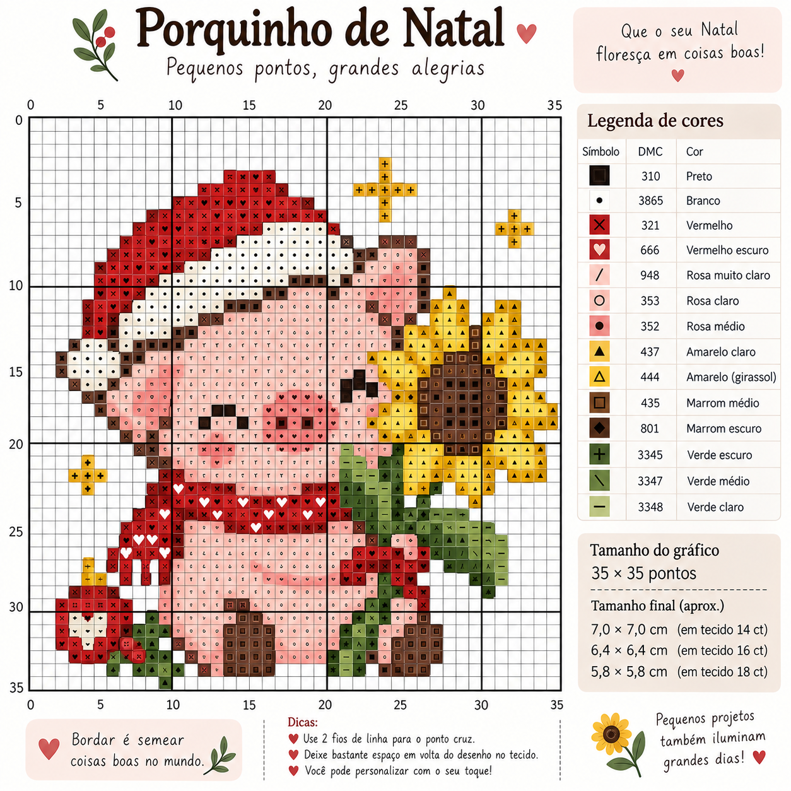
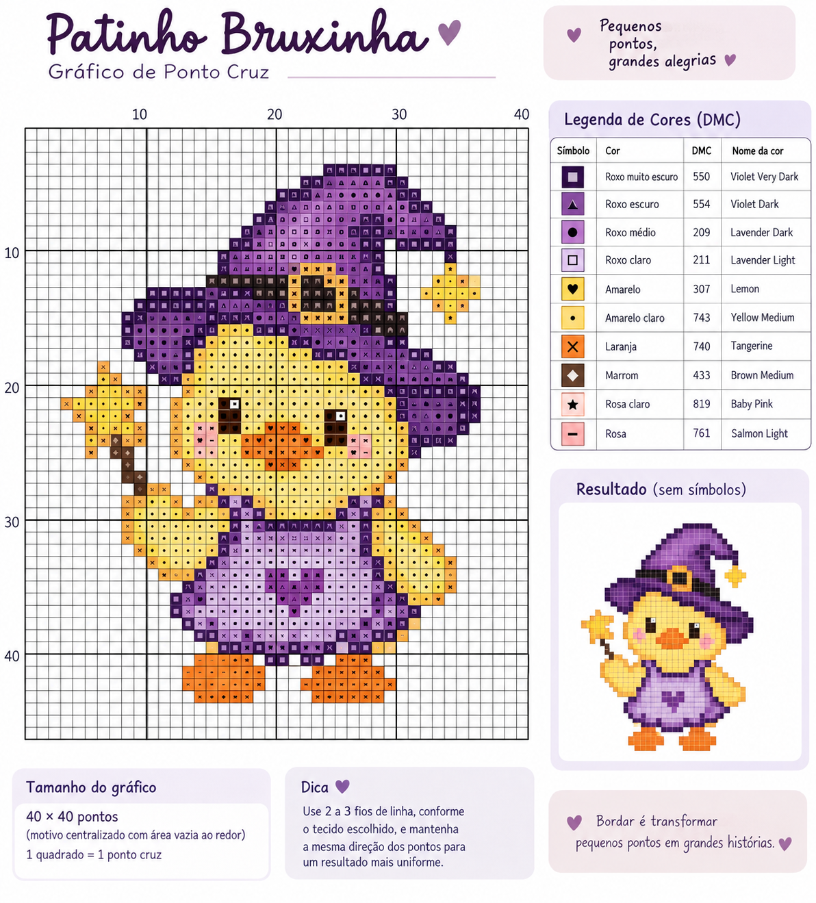
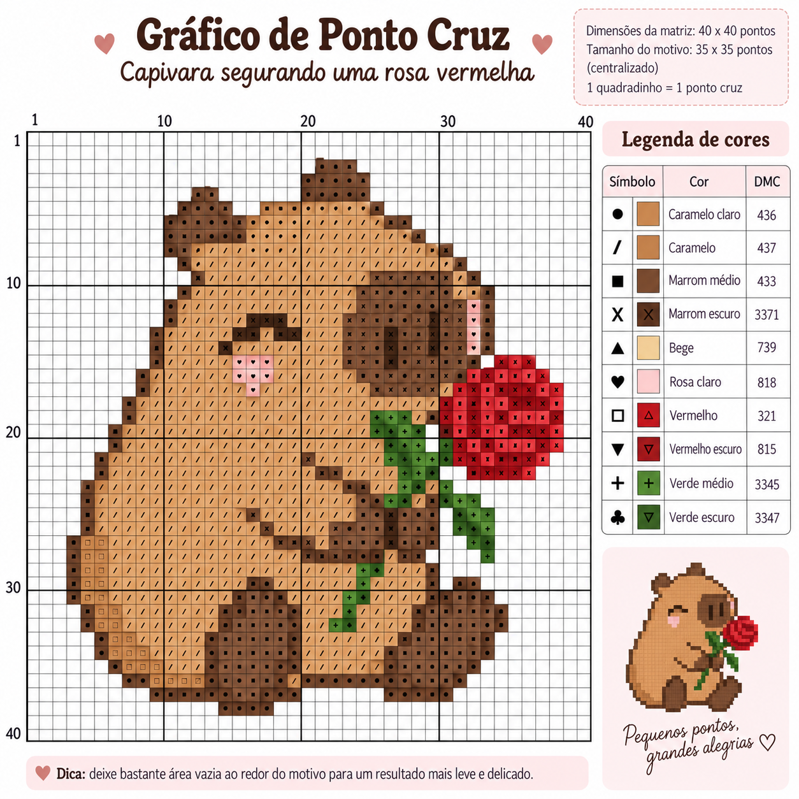
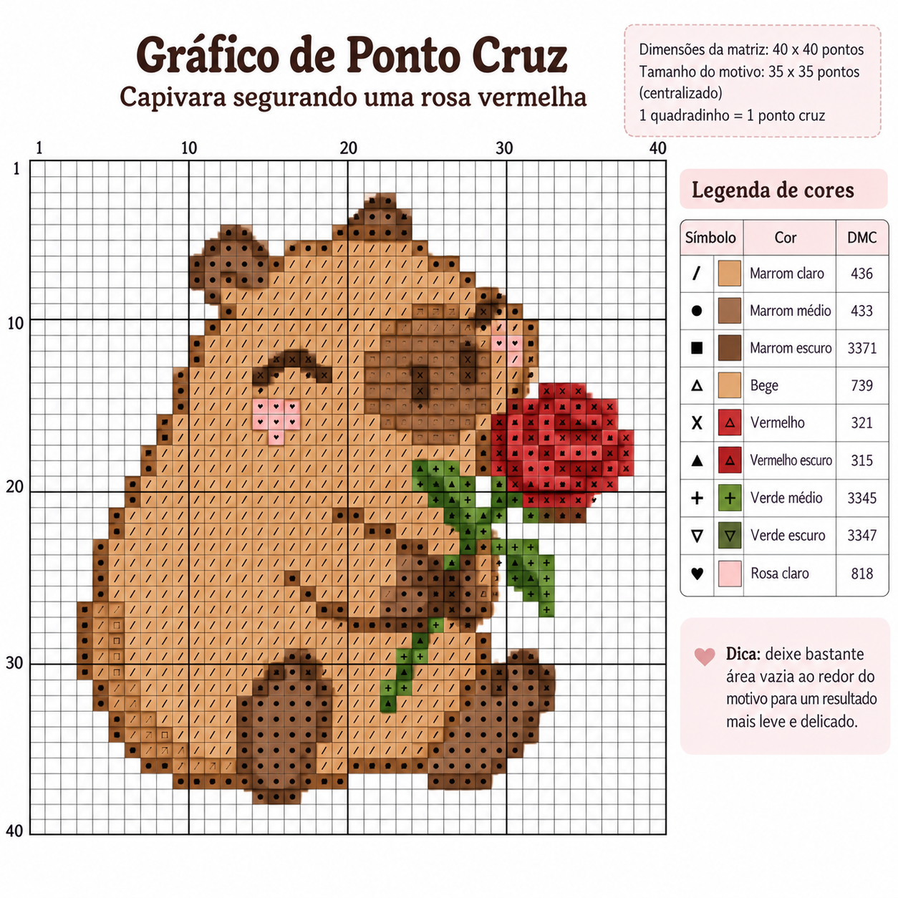

## 🧵 Gerador de Gráficos de Ponto Cruz

Um cantinho para transformar ideias fofinhas em gráficos de ponto cruz. 🌷

Este prompt transforma descrições curtas em gráficos pensados como pixel art:
cada quadradinho da grade representa um ponto cruz inteiro.

  

  <em>“Crie um porquinho fofo usando um gorrinho vermelho de Natal segurando um girassol.”</em>

### 🧶 Crie o seu

1. Abra o [`PROMPT.md`](./PROMPT.md);
2. No início do arquivo, troque **“Espaço pra descrever o desenho”** pela sua ideia. Pode ser um bichinho, uma flor, um objeto... o que você quiser bordar;
3. Copie o conteúdo do arquivo para uma ferramenta de IA capaz de gerar imagens e peça o gráfico;
4. Confira o resultado e, se estiver tudo certinho, é hora de pegar as linhas.

### 🔎 Antes de começar a bordar

Dê uma conferida no gráfico:

- Cada célula preenchida deve corresponder a **um ponto cruz inteiro** e conter apenas uma cor;
- As linhas mais fortes da grade devem aparecer a cada **10 células**;
- Cada cor deve ter seu próprio símbolo, identificado na legenda;
- O desenho deve caber nas dimensões pedidas, mesmo que a grade se estenda até o próximo múltiplo de 10.

### ✨ Exemplos criados

O mesmo prompt pode ser usado para experimentar personagens, objetos, temas e estilos diferentes.

  

  <em>“Crie um patinho amarelo com um avental e um chapéu de bruxa roxo.”</em>

 

  

  <em>“Crie uma capivara segurando uma rosa vermelha.”</em>

## 🪡 E se algum ponto sair estranho?

Pode acontecer. Às vezes a IA deixa uma cor sem preencher a célula inteira ou cria algum detalhe que precisa de ajuste.

Nesse caso, você pode mostrar o resultado e pedir uma correção simples:

  
  

  <em>“Ajuste os pontos que não estão ocupando o quadradinho inteiro.”</em>

## 🌱 Um projeto em construção

Este projeto nasceu de uma vontade simples: **criar meus próprios gráficos para bordar**.

Aos poucos, o prompt foi ganhando regras, testes e novos desenhos mas continua sendo experimentado e melhorado.

Como os gráficos são gerados por IA, ainda podem aparecer erros na contagem de células, na correspondência entre símbolos e cores ou na legenda. Por isso,
**confira seu gráfico ponto a ponto antes de começar um bordado definitivo**.

Se criar alguma coisa com ele, vou adorar saber o que virou bordado. 🧵🌷